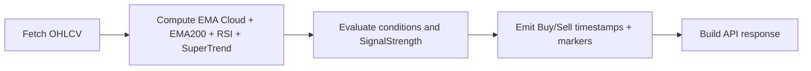

# AlphaScanner Architecture

## System Context Diagram
```mermaid
graph TD
  User((User)) --> UI[React 18 + Vite UI]
  UI -->|GET /analyze/{ticker}/{interval}| API[FastAPI Backend]
  API -->|OHLCV| YF[yfinance]
  API -.->|optional cache| Redis[(Redis)]
  API --> Engine[Pandas + numpy + pandas_ta Engine]
  Engine --> API
  API -->|JSON: candles + indicators + signals| UI
```

## Data Flow Diagram


## Tech Stack
| Layer | Technology |
| --- | --- |
| Frontend | React 18, TypeScript, Vite, lightweight-charts |
| Backend | FastAPI (async), Python |
| Data | pandas, numpy, pandas_ta, yfinance |
| Cache (optional) | Redis |
| Deployment | Vercel (FE), Railway/Render (BE) |

## Scalability Notes
- Use Redis to cache OHLCV data and avoid yfinance rate limits.
- Parallelize multi-ticker scans with asyncio or concurrent.futures.
- Keep the API payload compact by aligning candles, indicators, and signals on the same timestamp index.
